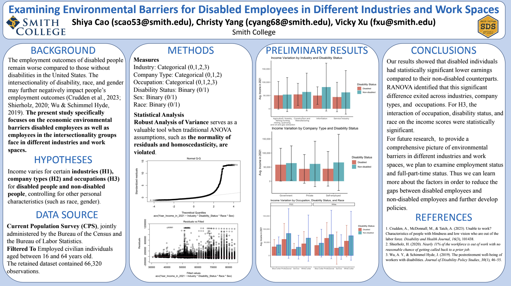

### Background:

The employment outcomes of disabled people remain worse compared to those without disabilities in the United States. The intersectionality of disability, race, and gender may further negatively impact people’s employment outcomes (Crudden et al., 2023; Shierholz, 2020; Wu & Schimmel Hyde, 2019). The present study specifically focuses on the economic environmental barriers disabled employees as well as employees in the intersectionality groups face in different industries and work spaces.



### Hypotheses:

Income varies for certain industries (H1), company types (H2) and occupations (H3) for disabled people and non-disabled people, controlling for other personal characteristics (such as race, gender).

### Data Source:

Current Population Survey (CPS), jointly administered by the Bureau of the Census and the Bureau of Labor Statistics.
Filtered To Employed civilian individuals aged between 16 and 64 years old. Recategorized Industry, Company Type, and Occupation into broader categories and converted Disability Status, Sex, and Race into binary variables.
The retained dataset contained 66,320 observations.

```scss
tab1 <- tab |> 
  #filter(Type_of_person == 2) |> # filter to PRPERTYP = 2 (Adult civilian household member)
  filter(Disability_Status != -1) |>
  filter(Age >= 16 & Age <= 64) |> # filter to working-age population
  mutate(Employment_Status = 
           case_when(Major_Labor_Force %in% c(1:2) ~ 0, # Employed
                     Major_Labor_Force %in% c(3:7) ~ 1  # Unemployed
  )) |>
  mutate(Disability_Status = 
           case_when(Disability_Status == 2 ~ 0, # Non-disabled
                     Disability_Status == 1 ~ 1 # Disabled
  )) |>
  mutate(Sex = case_when(Sex == 1 ~ 0, # Male
                         Sex == 2 ~ 1 # Female
  )) |>
  mutate(Race = case_when(Race == 1 ~ 0, # White-only
                          Race %in% c(2:26) ~ 1 # POC
  )) |>
  mutate(Marital_Status = 
           case_when(Marital_Status %in% c(1:3) ~ 1, # Married
                     Marital_Status %in% c(4:7) ~ 0  # Not married
  )) |>
  mutate(Age = case_when((Age >= 18 & Age <= 24) ~ 1,
                         (Age >= 25 & Age <= 34) ~ 2, 
                         (Age >= 35 & Age <= 44) ~ 0, 
                         (Age >= 45 & Age <= 54) ~ 3,
                         (Age >= 55 & Age <= 64) ~ 4
  )) |>
  mutate(Full_Part_time_status = 
           case_when(Full_Part_time_status %in% c(2:5) ~ 0, # Full time
                     Full_Part_time_status %in% c(6:10) ~ 1, # Part time
                     Full_Part_time_status %in% c(1, 11, 12) ~ 2 # Unemployed
  )) |>
  dplyr::select(-c(Major_Labor_Force:ERN_YN), -Type_of_person)

tab1<-tab1|>
  filter(Employment_Status == 0)
```

### Methods:

The `raov()` function, short for "Robust Analysis of Variance," serves as a valuable tool when conducting analysis of variance (ANOVA) on linear models in situations where traditional ANOVA assumptions, such as the normality of residuals and homoscedasticity, are violated within the dataset.
Employing the `raov()` function to construct models for each hypothesis ensures a comprehensive modeling approach, including the evaluation of main effects and interactions. The outcomes yield robust ANOVA tables, enhancing the reliability of statistical analysis in the presence of non-standard data characteristics.

```scss
tab1_industry_few <- tab1_industry |>
  mutate(Industry = case_when(Industry %in% c(1:2) ~ 0, # "Agriculture, forestry,fishing, and hunting", "Mining, quarrying, and oil and gas extraction"
                              Industry %in% c(3:4) ~ 1, # "Construction", "Manufacturing"
                              Industry %in% c(5:6,8:14) ~ 2, # Service Industry
                              Industry == 7 ~ 3 # "Information"
  ))
  
hypo2_1_ranova_1 <- tab1_industry_few |>
  dplyr::select(Disability_Status, Race, Sex, Year_Income_in_2021, Industry)|>
  rename(income=Year_Income_in_2021)

head(hypo2_1_ranova_1)

fit2_1 <- raov(income ~ Disability_Status + Sex + Race + Industry, data = hypo2_1_ranova)
fit2_1$table
```
### Results:

Our results showed that disabled individuals had statistically significant lower earnings compared to their non-disabled counterparts. RANOVA identified that this significant difference excited across industries, company types, and occupations. For H3, the interaction of occupation, disability status, and race on the income scores were statistically significant.
For future research, to provide a comprehensive picture of environmental barriers in different industries and work spaces, we plan to examine employment status and full-part-time status. Thus we can learn more about the factors in order to reduce the gaps between disabled employees and non-disabled employees and further develop policies.
