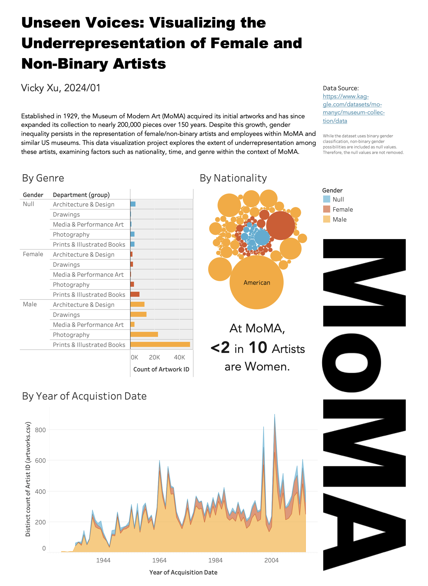

### Overview:

Established in 1929, the Museum of Modern Art (MoMA) acquired its initial artworks and has since expanded its collection to nearly 200,000 pieces over 150 years. Despite this growth, gender inequality persists in the representation of female/non-binary artists and employees within MoMA and similar US museums. This data visualization project explores the extent of underrepresentation among these artists, examining factors such as nationality, time, and genre within the context of MoMA. 

