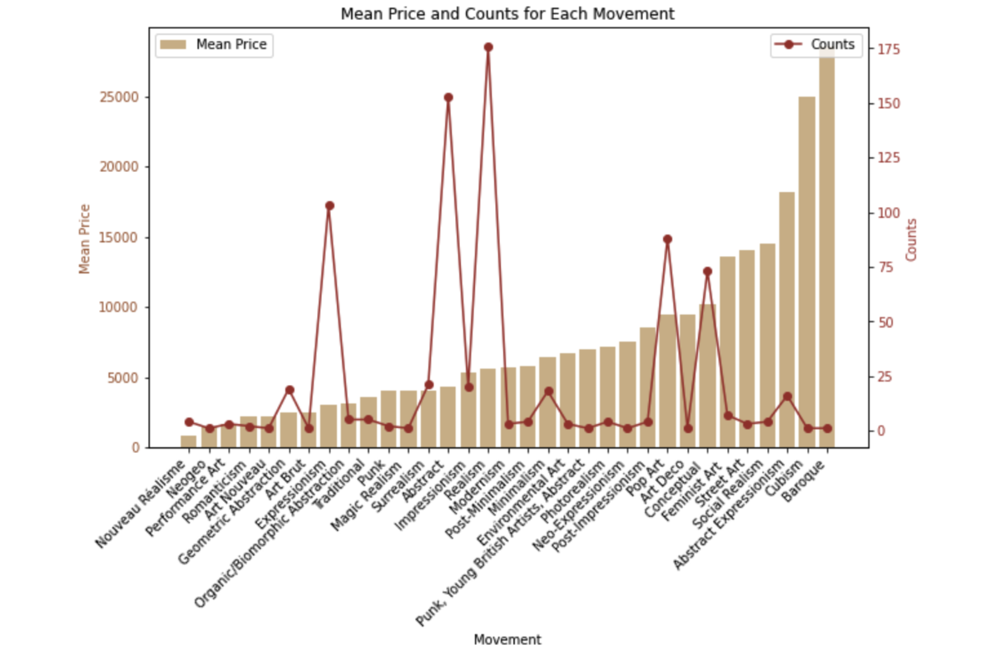

### Overview:

The AuctionDataAnalysis class is used for preprocessing auction records and generating a data analysis report to facilitate understanding trends and data patterns within the auction records. 

### Class Methods:

`__init__(file_path)`: Initializes the class with the specified dataset file path.

`preprocess_data()`: Preprocesses the dataset, including standardizing price formats and organizing movement orders.

`get_author_name()`: Retrieves the name of the report's author.

`get_record_num()`: Provides the count of auction records in the dataset.

`get_top_artists()`: Presents the total count of unique artists and lists the top ten contributing artists.

`get_top_titles()`: Displays the count of unique titles and highlights the most frequent five titles in the dataset.

`visualize_period_statistics()`: Generates a table detailing the Combined Price Statistics for Each Period (sorted in descending order by counts) and provides visual insights into Mean Price and Counts for Each Period.

`visualize_movement_statistics()`: Produces a table outlining the Combined Price Statistics for Each Movement (sorted in ascending order based on the historical timeline of movements) and showcases Mean Price and Counts for Each Movement.

### Usage

Please click the demo link above, which was tested by Sotheby's auction record.

