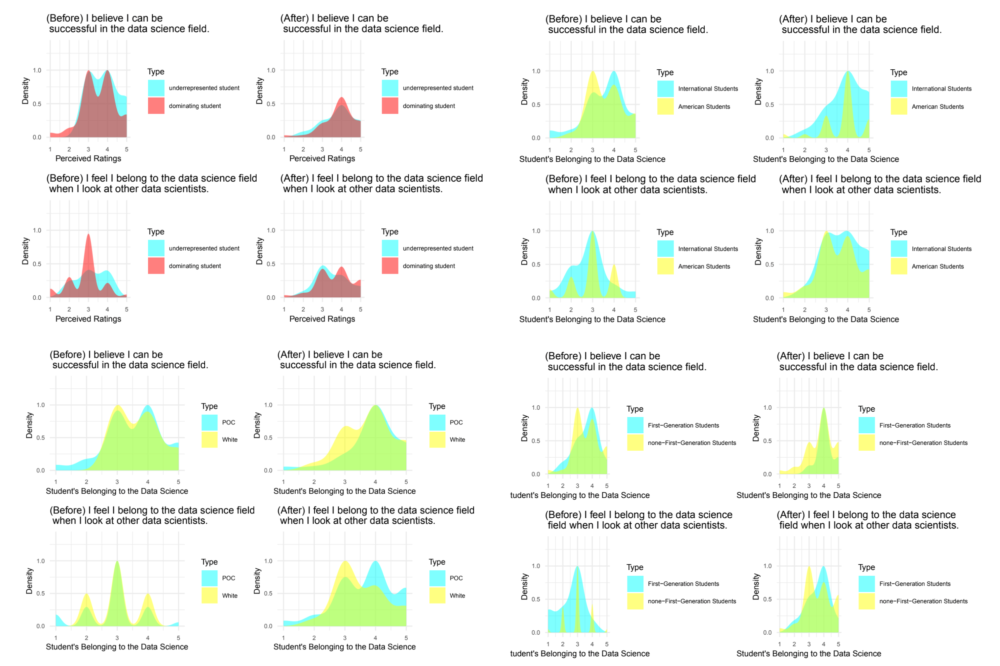

### Overview

College students are increasingly identifying with the disability term, but need more institutional support and visibility around disability. Data science (DS) attracts a lot of undergraduate students and should consider disability inclusion topics in its curriculum design to help raise disability awareness among students and include diverse students to drive innovation of the field. The data used in this study was collected in an Introduction to DS course that applied disability inclusion datasets. This study aims to understand how disability inclusion datasets are helpful for learning coding skills, feeling belonging to the DS field, and raising disability awareness. The results showed that students who put more effort in the disability inclusion datasets found them more helpful for coding skills improvement. Moreover, incorporating disability inclusion datasets in introductory DS pedagogy appeared to be helpful for underrepresented students to feel belonging to the DS field and raise disability awareness among students.

### Hypotheses

1. How are disability inclusion datasets helpful for college students to learn data science skills?
2. How are disability inclusion components in introductory data science pedagogy helpful for underrepresented college students to feel belonging to the data science field?
3. How do disability inclusion components in introductory data science pedagogy raise disability awareness among college students?

### Data Source:

In this study, data were collected through a pre-course survey and end-of-semester survey (approved by the Institutional Review Board) of the course in an institution during the spring semester of 2023. 
For the pre-course survey, out of the total number of registered students, 66 students took part in the questionnaire. However, only 61 students completed the entire questionnaire, resulting in a completion rate of 92.4%.
The end-of-semester survey was administered to all 60 students who successfully completed the course. Fifty-one students participated and completed the entire questionnaire, resulting in a completion rate of 100%.

### Methods:

To test the hypotheses in RQ1 and RQ3, regression analysis was employed to assess the influence of independent variables on dependent variables.
For RQ2, the distribution plots were used to see the trend of students’ sense of belonging to the data science field in the pre-course and the end-of-semester survey.
In qualitative analysis, open-ended survey responses were analyzed using the word cloud function (textplot_wordcloud in quanteda (version 0.99)).

### Results:

The results of RQ1 indicate that students who invested more effort in mini-projects utilizing the disability inclusion datasets had a significant positive relationship with higher perceived helpfulness of the datasets for data science skills development.

From RQ2, integrating disability inclusion datasets into introductory data science pedagogy helps underrepresented college students feel more belonging to the data science field. This trend persists in each breakdown of underrepresented student groups, including students of color, international students, and first-generation students.

In RQ3, due to the small sample size, no statistically significant findings were observed. Nevertheless, it was evident that students became increasingly aware of disability inclusion, particularly among those with initially low and medium exposure to these topics.

### Discussions:

To enhance future research, improvements in survey design should focus on capturing more nuanced aspects of group dynamics within the group mini-projects. This can be achieved by incorporating measures of team cohesion, communication effectiveness, and task allocation. Conducting post-project interviews could also provide valuable insights into individual contributions and shed light on the impact of group dynamics. 

The present study acknowledges the limitation of a small sample size, which hindered the ability to categorize groups and conduct robust statistical analyses due to the limited data points within each group. Accumulating a larger sample size will enable more precise categorization in more comprehensive statistical analyses. 

For RQ2, additional questions can be included in the surveys, such as: “Does your family have an opinion on your pursuit of STEM?”, “Do the people in your immediate surroundings have an opinion on your pursuit of STEM?”, “To what extent is your STEM pursuit influenced by others’ opinions?” By adding these questions, we
may be able to delve deeper into the causes behind the improvement in the sense of belonging and explore the differences between underrepresented students and those from dominanting groups. 

Based on the results of RQ3, educators should incorporate more disability inclusion datasets or concepts into their courses. It can foster innovation and development among a diverse student body in the field of statistics and data science. Moreover, this inclusionary approach has the potential to advance diversity and inclusivity within STEM and increases disability awareness in the data science and statistics community specifically.

