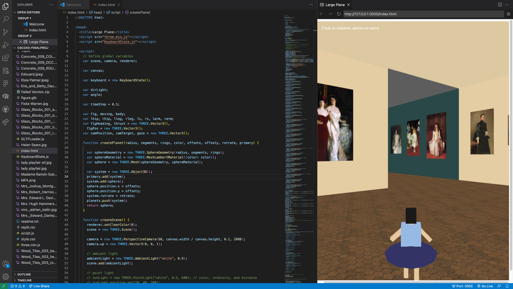

### Overview:

The project replicates two showrooms from the "Fashioned by Sargent" exhibition at the Museum of Fine Arts, Boston. The setting and layout precisely mirror those of the original exhibition, and the size of the paintings matches their actual, unframed dimensions. The goal is to provide users with an immersive online experience of this remarkable exhibition. By encountering Sargent's portraits, the exhibition prompts us to rethink the art of image-making and whether a portrayal is truthful, aspirational, or purely imaginative. These reflections are particularly intriguing within the context of our digital age, dominated by social media, video conferencing, and the age of selfies.

### Keyboard Control:

The user can utilize the keyboard to control the character in a third-person perspective.

* By typing "space" or "up", the figure will move forward.
* By typing "backspace" or "down", the figure will move backward.
* By typing "left", the figure will turn left.
* By typing "right", the figure will turn right.
Additionally, the character is restricted from surpassing the front wall, the right glass, and the left wall. Upon hitting these boundaries, further movement is restricted.

Please use "backspace" or "down" to retreat from the wall and continue walking without collision.

### Detail Description

To be specific, the user starts from the first room, where the right side features a glass wall for curation purposes. This room showcases Sargent's early period works, all portraying Sargent's patrons.

There are four portraits on the front wall , arranged from right to left:

1. Madame Ramón Subercaseaux, 1880, Oil on canvas, 65 × 43 1/4 in. (165.1 × 109.9 cm)
2. Edith, Lady Playfair (Edith Russell), 1884, Oil on canvas, 59 7/8 × 38 3/4 in. (152.1 × 98.4 cm)
3. Edouard Pailleron, 1879, Oil on canvas, 37 13/16 × 15 3/16 in. (96 × 38.5 cm)
4. Eleanora O'Donnell Iselin (Mrs. Adrian Iselin), 1888, Oil on canvas, 60 1/2 × 36 5/8 in. (153.7 × 93 cm)

Two portraits on the side wall (from right to left):

1. Ena and Betty, Daughters of Asher and Mrs Wertheimer, 1901, Oil on canvas, 185.4 × 130.8 cm
2. Portrait of Mrs. Edward L. Davis and Her Son, Livingston Davis, 1890, Oil on canvas, 86 1/8 × 48 1/4 in. (218.76 × 122.56 cm)

Then the user can proceed to the next room, where the color palette becomes more vibrant. Take a moment to look at the sumptuous textiles and elegant silhouettes!

Four portraits on the front wall (from right to left):

1. Elsie Palmer, 1889–90, Oil on canvas, 75 1/8 x 45 1/8 in.(190.8 x 114.6 cm)
2. Helen Sears, 1895, Oil on canvas, 65 7/8 × 36 in. (167.3 × 91.4 cm)
3. Mrs. Joshua Montgomery Sears (Sarah Choate Sears), 1899, Oil on canvas, 58 1/8 × 38 1/8 in. (147.6 × 96.8 cm)
4. Mrs. Fiske Warren (Gretchen Osgood) and Her Daughter Rachel, 1903, Oil on canvas, 60 × 40 3/8 in. (152.4 × 102.6 cm)

Two portraits on the side wall (from right to left):

1. Mrs. Edward Darley Boit (Mary Louisa Cushing), 1887, Oil on canvas, 60 1/4 × 42 in. (153 × 106.7 cm)
2. Portrait of Mrs Robert Harrison, 1886, Oil on canvas, 157.8 × 80.3 cm

One portraits on the back wall:

1. Mrs. Hugh Hammersley, 1892, Oil on canvas, 81 x 45 1/2in. (205.7 x 115.6cm)

The exit door is located on the back wall of the second room, marking the end of the tour.

If you wish to revisit the first room, you can either exit the building and re-enter through the first room's entry or simply click the refresh button, which will return you to the starting point in the first room.

